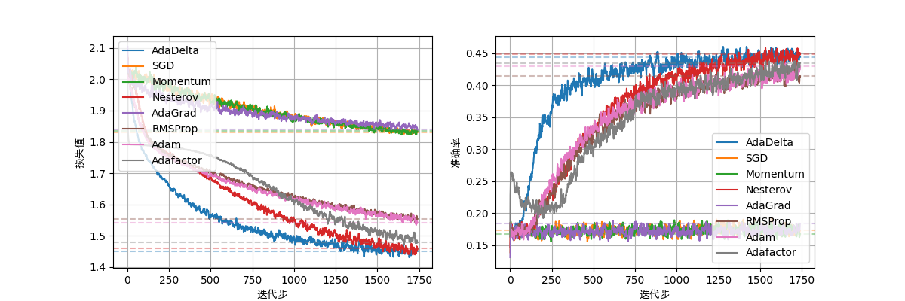

# A Machine Learning Framework For Testing Every Part in Basic ML Model.



This is a project aim for using a easy machine learning algorithm to classify songs into different styles.

One of the aim of this project is to compare some variables in basic machine learning programs such as optimizer, regular term, learning rate, etc. I use eight optimize algorithms in total and give a framework for others to test any changes they want to make in basic machine learning model.

Specifically, I use logistic regression algorithm. Ths music data is from a famous music app Spotify.

Spotify is a Swedish online music streaming platform. It provides 12 features for each track, making a series of descriptions of the music from aspects such as musicality, perception, and descriptiveness. There are six major music categories in Spotify's music library, namely rap, rock, electronic dance music, R&B, Latin music, and pop music. In addition, it also provides information such as the unique ID of each piece of music, the name of the track, the composer, and the popularity of the track.
| Feature | Description |
| ---- | ---- |
| **acousticness（声学性）** | The proportion of purely acoustic elements in the song |
| **liveness（现场感）** | Whether the song has the characteristics of a live performance |
| **speechiness（语音性）** | The proportion of speech content in the song |
| **instrumentalness（乐器性）** | The dominant degree of instrumental performance in the song |
| **energy（能量感）** | The degree of vitality and dynamic feeling that the music gives people |
| **loudness（响度）** | The overall volume level of the song |
| **danceability（舞蹈性）** | The degree to which the song is suitable for dancing |
| **valence（情感价）** | The positive or negative emotions conveyed by the song |
| **duration（时长）** | The duration of the song |
| **tempo（节奏）** | The tempo speed of the song |
| **key（调式）** | The basic key of the song |
| **mode（模式）** | Whether the song belongs to a major key or a minor key |

We will utilize these 12 features and the popularity of the music pieces provided by Spotify's music library, making a total of 13 attributes. Taking the six major music categories as the classification basis, we will build a multi-class classification model to help us automatically classify the music pieces that will enter the music library in the future. [The Kaggle competition website](https://www.kaggle.com/datasets/joebeachcapital/30000-spotify-songs) provides data of 28,356 songs and the already labeled style tags.

You can use below code in bash to run the training code.

```bash
bash LogReg_Train.sh
```

Below code can plot the result.

```bash
bash LogReg_Plot.sh
```
